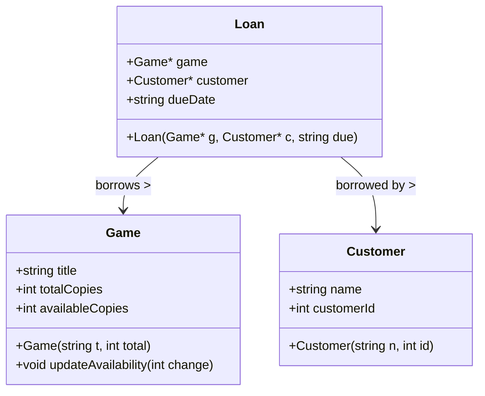

# Program Specification

This program is designed to help manage the lending process at a local board game café. It keeps track of all board games in the café's inventory, including the number of available copies. It allows games to be checked out to customers, tracks who has borrowed which games, and records when games are returned. The program provides basic inventory and lending management functionality.

Entities involved include games, customers, and lending transactions. The system allows viewing available games, checking out games, and checking them back in.

---

## Nouns and Verbs

### Nouns (likely classes or attributes)
- Game
- Customer
- Loan / LendingRecord
- Inventory
- Due Date

### Verbs (likely methods or behaviors)
- Add Game
- Check Out Game
- Return Game
- List Available Games
- Track Borrowed Games

---

## Class Design

### `Game`
```cpp
class Game {
public:
    std::string title;
    int totalCopies;
    int availableCopies;

    Game(std::string t, int total);
    void updateAvailability(int change);
};
```

### `Customer`
```cpp
class Customer {
public:
    std::string name;
    int customerId;

    Customer(std::string n, int id);
};
```

### `Loan`
```cpp
class Loan {
public:
    Game* game;
    Customer* customer;
    std::string dueDate;

    Loan(Game* g, Customer* c, std::string due);
};
```

---

## Mermaid Class Diagram



