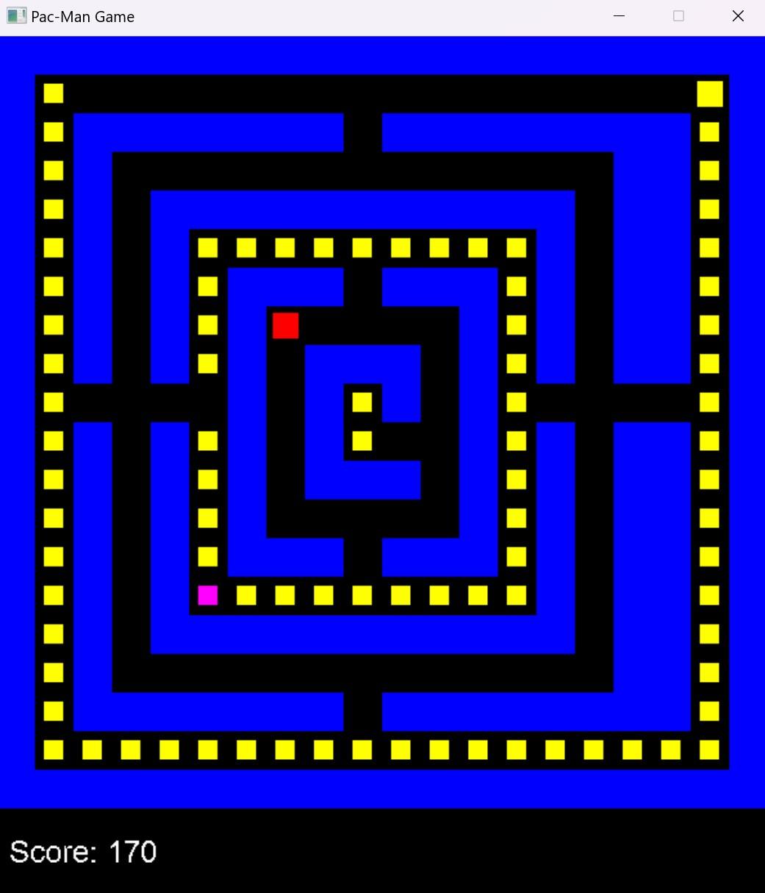

# Project 04 – Pac-Man Maze Game

## 🕹️ Description

This is a Pac-Man-inspired maze game written in C++ using SDL2. Navigate Pac-Man through the maze, collect pellets, and avoid ghosts. The game ends when all pellets are collected or Pac-Man is caught by a ghost.

## 🎮 Controls

- Arrow Keys: Move Pac-Man (Up, Down, Left, Right)
- `R`: Restart the game
- `Esc`: Exit the game

## 🧪 Screenshot

## ✨ Extra Features

- Dynamic ghost movement with random direction changes
- Power-ups that grant bonus points
- Adjustable Pac-Man movement speed
- A fully customizable maze layout